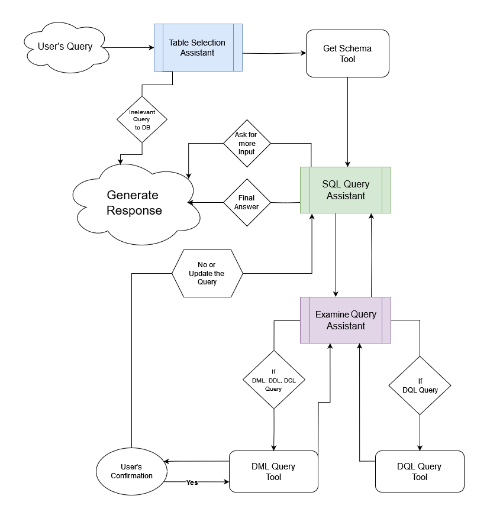

# SQL Agent

## Project Overview

### Introduction
**SQL Agent** is an advanced chatbot powered by LLM with function calling, designed to convert natural language queries into SQL statements and execute them seamlessly. The agent intelligently identifies whether a user's query pertains to reading from the database (DQL) or involves data modification (DML, DDL, or DCL). Based on this classification, it invokes the necessary tools. For DML, DDL, or DCL queries, the agent pauses execution to seek user confirmation before proceeding, ensuring safe and intentional data modifications. Additionally, the agent validates the generated SQL query for correctness and offers rectification if needed. By automating the interaction with the database, SQL Agent eliminates the need for users to manually write SQL queries.

### Tech Stack
- **Python**
- **Langchain**
- **Langgraph**
- **SQLite**
- **OpenAI**

## Features
- **Natural Language Processing for SQL Queries**: Converts user queries into SQL commands.
- **Database Interaction in Natural Language**: Allows users to interact with databases without writing SQL.
- **Interactive Decision Making**: Pauses execution for user confirmation on data-modifying operations.
- **Query Verification**: Checks and rectifies SQL queries for common mistakes.
- **Streaming Responses & Interrupt Handling**: Provides real-time responses and handles user interrupts gracefully.

## Architecture



### Process:
1. **User Input**: The agent receives the user's input in natural language.
2. **Table Selection Assistant**: Selects relevant table names based on the input.
3. **Schema Generation**: Generates the schema for the selected tables.
4. **Query Generation Assistant**: Creates the SQL query based on the input and schema.
5. **Examine Query Assistant**: Verifies the query for common SQL mistakes and rectifies if needed.
6. **Tool Invocation**:
   - **DQL Queries**: Executes without interruption.
   - **DML, DDL, DCL Queries**: Pauses for user confirmation before execution.
7. **Execution & Response**: Executes the query, handles any updates or confirmations from the user, and returns the result.

### Module Breakdown
- **`src/db`**: Manages database connection.
- **`src/tools`**: Contains tool definitions used by the agent.
- **`src/utils`**: Utility functions supporting various operations.
- **`src/runnables`**: Assistants that process different stages in the agent.
- **`src/graph`**: Defines the workflow and state management.
- **`src/agent`**: The core agent logic.
- **`sql-agent.ipynb`**: Jupyter Notebook version for in-depth exploration.
- **`Chinook.db`**: Sample SQLite database for interaction.
- **`src/main.py`**: Entry point for running the agent.

## Installation and Setup

### Requirements
Install the required Python libraries:
```bash
pip install -r requirements.txt
```
### Environment Variables 
Create a `.env` file with the following variables:
```
OPENAI_API_KEY=<your_openai_api_key>
DB_PATH=./Chinook.db
```
### Usage 
- **Running the Agent**: Execute the agent by running `src/main.py`:
```bash
python src/main.py
```
**Note**: The agent currently operates in CLI mode. A graphical chat interface is coming soon.

- **For Developers**: If you prefer to explore the agent's functionality in depth, open the `sql-agent.ipynb` notebook in Jupyter.”

### Contributing 
If you discover issues or have ideas for improvements, feel free to raise a PR or open an issue. Contributions are welcome!

### Contact 
* **LinkedIn**: [Tapaswi-V-S](https://www.linkedin.com/in/tapaswi-v-s/) 
* **Email**: [satyapanthi.t@northeastern.edu](mailto:satyapanthi.t@northeastern.edu)

## 📜 License
This project is licensed under the MIT License—see the [LICENSE](LICENSE) file for details.

Thank you for checking out SQL Agent! Your interest and support are greatly appreciated. I hope this project proves valuable to you. If you have any feedback, suggestions, or just want to say hello, feel free to reach out. Happy coding!

Best regards,  
**Tapaswi V S**